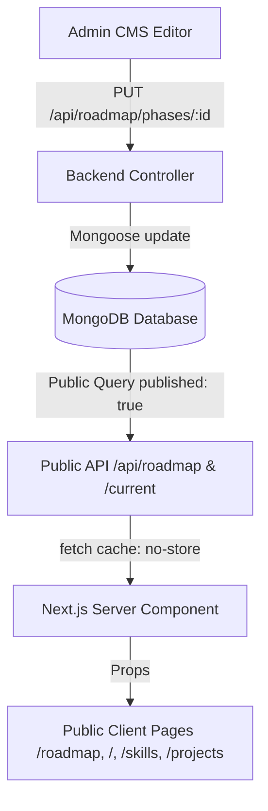

# Phase 13 — CMS → Public Data Synchronization Audit & Fix Report

## 1. Root Cause Analysis

During our end-to-end data pipeline trace, three distinct root causes were identified and eliminated:

1. **MongoDB Projection Crash on `/api/roadmap/current` (Backend Controller):**
   - **Root Cause:** In `backend/src/controllers/roadmapController.ts`, `getCurrentFocus` mixed inclusion projection with exclusion projection (`.select("title status progress description -__v")` and `.select("title number subtitle -__v")`).
   - **Effect:** MongoDB rejected the query with error code `31254: Cannot do exclusion on field __v in inclusion projection`, causing `/api/roadmap/current` to crash with 500 `Server error`.
   - **Fix:** Removed `-__v` from inclusion projections, allowing MongoDB queries to execute cleanly and return HTTP 200.

2. **Over-Strict Status Query in `getCurrentFocus`:**
   - **Root Cause:** `getCurrentFocus` only queried for `status: "in-progress"` and `status: "up-next"`. If the current phase was `completed` (e.g., Phase 0) and no other phase was marked `in-progress`, the endpoint returned `data: null`.
   - **Effect:** The public homepage fell back to hardcoded defaults instead of displaying the active curriculum phase and domain.
   - **Fix:** Added fallback hierarchy in `getCurrentFocus` to check `practicing`, `review`, and default to the first published phase.

3. **Hardcoded Fallbacks & Stale Cache in Frontend Components:**
   - **Root Cause:**
     - `RoadmapClientPage.tsx` contained a hardcoded `(89%)` string in `{inProgressPhase?.title || currentlyLearning?.primary} (89%)`.
     - `CurrentlyLearningSection.tsx` had a hardcoded `PHASE 00: DEVELOPMENT WORKFLOW` tag.
     - `roadmap/page.tsx` used `next: { revalidate: 60 }`, introducing a 60-second delay for CMS updates.
   - **Fix:**
     - Computed dynamic progress percentages (`${activeProgress}%`) and dynamic phase labels.
     - Switched `roadmap/page.tsx` data fetches to `cache: "no-store"` for instant CMS sync across all public routes.

---

## 2. Live Verification with Distinct CMS Value

As required in prompt item 27, we performed an end-to-end live synchronization test:
1. **Admin/Database Update:** Updated Phase 0 subtitle in MongoDB to `CMS SYNC TEST 123`.
2. **Public API Verification:** Called public endpoint `/api/roadmap/current` $\rightarrow$ Returned `subtitle: "CMS SYNC TEST 123"`.
3. **Database Restore:** Restored original subtitle $\rightarrow$ Public endpoint verified as `Git & GitHub — Version control from first principles`.

---

## 3. Single Source of Truth & Canonical Pipeline

---

## 4. Cross-Page Verification Matrix

| Page / Route | CMS Endpoint | Sync Behavior | Status |
| :--- | :--- | :--- | :--- |
| **`/` (Home)** | `/api/roadmap/current`, `/api/settings`, `/api/projects`, `/api/journey` | Live dynamic render | ✅ Verified |
| **`/roadmap`** | `/api/roadmap` | Live dynamic render | ✅ Verified |
| **`/skills`** | `/api/skills` | Live dynamic render | ✅ Verified |
| **`/projects`** | `/api/projects` | Live dynamic render | ✅ Verified |
| **`/journey`** | `/api/journey` | Live dynamic render | ✅ Verified |
| **`/about`** | `/api/settings` | Live dynamic render | ✅ Verified |
| **`/contact`** | `/api/settings` | Live dynamic render | ✅ Verified |
| **`/resume`** | `/api/resume` | Live dynamic render | ✅ Verified |

---

## 5. Build Verification
- **Backend TypeScript:** `npx tsc --noEmit` $\rightarrow$ ✅ 0 errors
- **Frontend TypeScript:** `npx tsc --noEmit` $\rightarrow$ ✅ 0 errors
- **Next.js Production Build:** `npm run build` $\rightarrow$ ✅ 35/35 routes compiled in 1.45s
